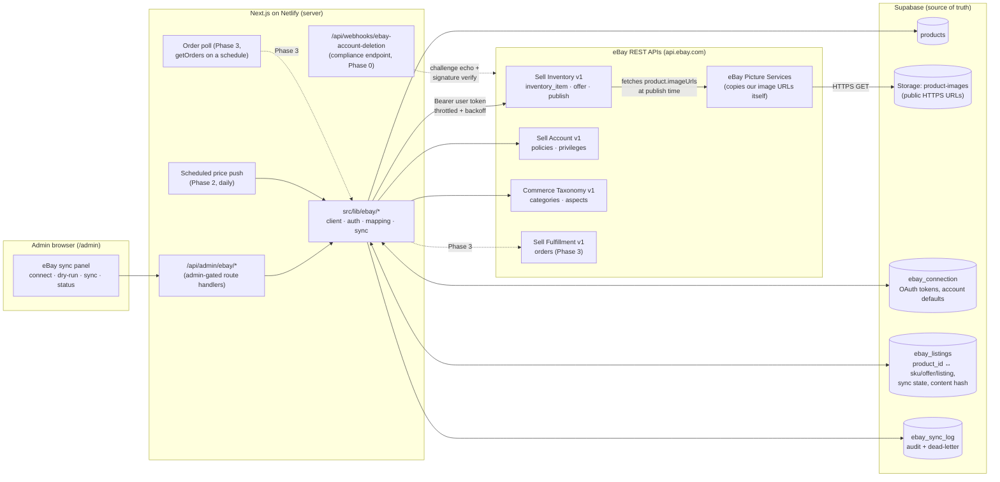

# 01 — Architecture Overview

> Planning only. See [README.md](README.md) for index.

## Principles

1. **Supabase `products` is the source of truth.** eBay is a downstream
   mirror. Nothing on eBay is ever authoritative for catalog data. The only
   data that may ever flow eBay → us is order events (optional Phase 3, via
   `getOrders` polling), and even then it only decrements inventory / flips
   status via the same paths the site uses — it never edits copy, pricing
   inputs, or images.
2. **Admin-driven and observable.** Every push is triggered (or scheduled) by
   the owner from `/admin`, has a dry-run preview, and leaves an audit row.
3. **Small idempotent steps, not one big job.** Same checkpointed step
   machine as the Etsy sync. eBay needs only ~3–4 calls per product (no image
   uploads), so a single invocation usually completes a whole product — but
   the checkpoint discipline stays because it's what made the Etsy build
   resumable and duplicate-proof.
4. **Flattened values at the boundary.** eBay has no spot-formula pricing and
   is EN-only on EBAY_US; we compute the concrete USD price (via
   `next-app/src/lib/pricing.ts`) and pick the EN copy at push time — same
   pattern as Etsy, with a separate eBay markup % (fees differ; see
   [13-open-questions.md](13-open-questions.md) Q2).
5. **Symmetry with `lib/etsy/` is a feature.** Same module names, same route
   naming, same table shapes, same admin panels. Whoever maintains one
   channel can maintain the other.

## System diagram

Note the image arrow direction: unlike Etsy (where our server downloaded,
transcoded, and multipart-uploaded every image), **eBay pulls our public
image URLs itself** and copies them to its Picture Services. Our function
never touches image bytes ([05-image-pipeline.md](05-image-pipeline.md)).

## Components

| Component | Location (proposed) | Role |
| --- | --- | --- |
| eBay API client | `next-app/src/lib/ebay/client.ts` | Fetch wrapper: `Authorization: Bearer`, `Content-Language: en-US` where required, JSON + error-envelope parsing (`errors[]` with `errorId`/`category`), throttle + 429/5xx backoff, typed `EbayApiError` with operator-facing message. Modeled on the shipped `src/lib/etsy/client.ts`. |
| OAuth module | `next-app/src/lib/ebay/auth.ts` | Authorize-URL builder (RuName), code exchange, refresh (non-rotating token, single-flight guard), AES-256-GCM encryption (same scheme as `etsy/auth.ts`), persistence via `ebay_connection`. See [04](04-oauth-and-secrets.md). |
| Field mapper | `next-app/src/lib/ebay/mapping.ts` | Pure functions `Product` → `InventoryItem` + `Offer` payloads. Title 80-char truncation, description/spec-block composition, **aspects** (Metal, Metal Purity, …), condition, category resolution, price flattening + eBay markup, pre-flight checks, content hash. **Allowlist-based like the Etsy mapper** — only named public fields are ever read, so `cost_basis`/`minimum_price`/`internal_notes`/etc. structurally cannot leak. Unit-tested; also powers dry-run. See [02](02-field-mapping.md). |
| Sync engine | `next-app/src/lib/ebay/sync.ts` | Step machine per product (item → offer → publish → update / end), checkpointed in `ebay_listings`; Phase 2 bulk queue + drain (with the Etsy build's claim-RPC + stall-guard lessons baked in); price-only fast path via `bulkUpdatePriceQuantity`. See [03](03-sync-lifecycle.md). |
| Store module | `next-app/src/lib/ebay/store.ts` | Typed access to the `ebay_*` tables (service-role only), mirroring `etsy/store.ts`. |
| Admin routes | `next-app/src/app/api/admin/ebay/*` | Connect/callback/status/preview/sync/disconnect/settings. Admin-gated like `/api/admin/etsy/*`. See [09](09-api-routes.md). |
| Compliance webhook | `next-app/src/app/api/webhooks/ebay-account-deletion/route.ts` | **Phase 0, required before the production keyset activates**: GET challenge echo + POST notification ack with signature verification. See [15](15-compliance.md). |
| Admin UI | `/admin/settings` panel + Product Admin column | eBay twin of `EtsySettingsPanel` / `EtsyProductPanel` / `EtsyBulkSyncModal`. See [07](07-admin-ux.md). |
| Sync state tables | Supabase (`ebay_*`) | Mapping, tokens, log. See [08](08-database-schema.md). |

## Sync directions

| Flow | Direction | Phase | Trigger |
| --- | --- | --- | --- |
| Initial publish (item → offer → publish) | Site → eBay | 1 | Admin button (per product) |
| Bulk publish | Site → eBay | 2 | Admin button (queued, chunked) |
| Incremental update (copy/price/qty/images changed) | Site → eBay | 2 | Admin button + content-hash diff; scheduled price push for spot items |
| Hide/end on sold/archived/deleted | Site → eBay | 2 (manual in 1) | Product status change hook / admin button |
| eBay sale → decrement our inventory | eBay → Site | 3 (optional) | Scheduled `getOrders` poll (eBay's seller webhooks are thin; polling is eBay's own recommendation) |

## ID mapping (who owns which key)

| Ours | Theirs | Stored in |
| --- | --- | --- |
| `products.id` | Inventory **SKU** (the primary key of eBay's inventory model, ≤50 chars — our ids fit) | `ebay_listings.product_id ↔ ebay_listings.ebay_sku`. **Decided (Q11): SKU = `products.id` verbatim** — guaranteed unique + stable; `products.sku` stays unused for eBay, same conclusion the Etsy build reached. |
| — | `offerId` (one per SKU + `EBAY_US` + `FIXED_PRICE`) | `ebay_listings.ebay_offer_id` |
| — | `listingId` (assigned at publish; changes on re-publish after a withdraw) | `ebay_listings.ebay_listing_id` |
| `product_type` (fallback `jewelry_type`, `inferProductJewelryType`) | `categoryId` (leaf, tree 0 for EBAY_US) | static map in `mapping.ts` (pinned at build time from `getCategorySuggestions`, names in comments) |
| — | `fulfillmentPolicyId`, `paymentPolicyId`, `returnPolicyId`, `merchantLocationKey` | `ebay_connection` defaults columns (created once, see [06](06-account-prerequisites.md)) |
| image URL entries (`products.image_urls`) | `product.imageUrls[]` on the inventory item | not separately tracked — the URL list is part of the content hash; no per-image table needed (no per-image API calls exist). See [05](05-image-pipeline.md). |

`ebay_listings` is the join table everything hangs off: sync state, last
pushed content hash, last error, timestamps. A product with no row there has
never been synced; a row with `sync_state='ended'` records a withdraw.

## Trust boundaries

- eBay credentials/tokens: server-only. Read via service-role Supabase client
  inside route handlers; RLS denies all client access ([08](08-database-schema.md)).
- All `/api/admin/ebay/*` routes verify the signed-in Supabase user is an
  admin (same check as the Etsy routes) **before** touching tokens or eBay.
- The account-deletion webhook verifies eBay's `x-ebay-signature` (ECDSA,
  public key via the Notification API, cached ~1h) and is idempotent.
- Browser never sees the Client ID/Cert ID or tokens; the admin UI only sees
  derived status (connected account, expiry, sync states).

## Why not a standalone worker / third-party connector?

Same reasoning as Etsy, and it held up in production there:

- The catalog is small (~78 products as of 2026-07-09) and the owner already
  lives in `/admin`; a Netlify-hosted admin-triggered sync avoids new
  infrastructure.
- Third-party sync tools can't reproduce spot-linked pricing or our
  status/quantity semantics.
- eBay's default quotas (Inventory API: 2,000,000 calls/day) are five orders
  of magnitude beyond this catalog's needs ([10](10-rate-limits-and-quotas.md)).
  The other capacity dimension — eBay's **monthly selling limits** — is
  confirmed a non-issue for the owner's existing account (Q14,
  [06](06-account-prerequisites.md)).

## Key differences from the Etsy integration (summary)

| Dimension | Etsy (shipped) | eBay (this plan) |
| --- | --- | --- |
| Listing model | one `listing` object | `inventoryItem` (SKU) + `offer` + publish → `listingId` |
| Review gate | native draft state on Etsy | **none** — publish is live immediately; the unpublished offer + our dry-run is the gate ([13](13-open-questions.md) Q1) |
| Images | download → WebP→JPEG transcode → multipart upload per image | pass public HTTPS URLs; **WebP accepted**; eBay copies to EPS itself |
| Calls per publish | ~12 (avg 6.7 images) | ~3–4 |
| Title cap | 140 chars | **80 chars** |
| Refresh token | rotates on every refresh, 90-day idle expiry | **non-rotating, ~18-month hard expiry** |
| PKCE | required | not supported (confidential client, Basic auth) |
| Vintage rule | 20+ years policy, `when_made` buckets | **no vintage requirement at all** — `item_year` is just an aspect/description detail |
| Sandbox | none (test against real shop) | real sandbox exists (flaky for images/search — see [14](14-verification-checklist.md)) |
| Sold-item handling | deactivate listing | quantity→0 + Out-of-Stock Control (hidden, revivable) — **decided Q7**; withdraw for archived/deleted |
| Fees to price in | ~6.5% + ~3% processing | **~13–15% final value fee** (category-dependent) + $0.30/order — hence the separate admin-variable eBay markup, seeded 15% (**decided Q2**) |
| Eligible catalog | everything `available` incl. coins/bullion (Etsy Q7) | everything `available` **except Coin/Bullion** (**decided Q6**; silverware included per Q6b) |
| Hard platform gates | app approval | production keyset disabled until account-deletion-notification compliance (subscribing — **decided Q10**); business-policy opt-in; selling limits (confirmed non-issue — **Q14**) |
