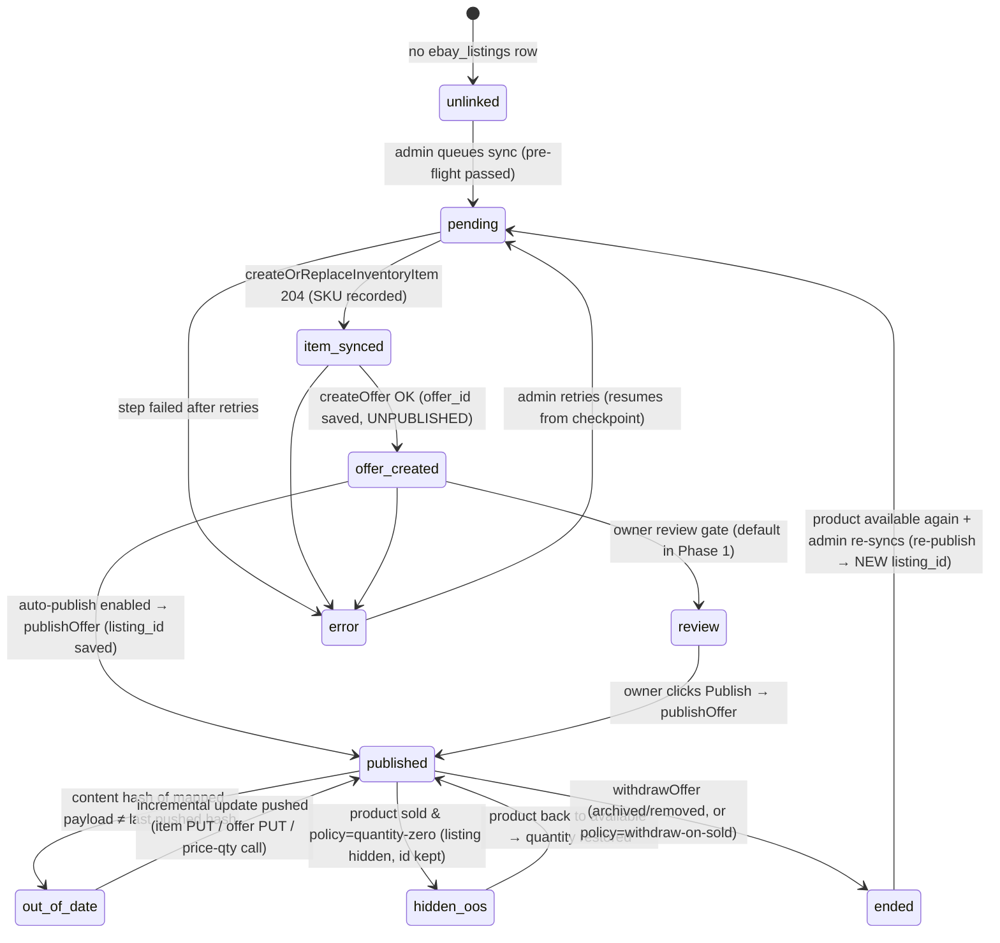

# 03 — Sync Lifecycle & State Machine

> Planning only. The sync engine (proposed `next-app/src/lib/ebay/sync.ts`)
> drives everything below; per-product state lives in `ebay_listings`
> ([08-database-schema.md](08-database-schema.md)).

## Design constraints that shape the lifecycle

- **eBay has no draft-for-review.** `publishOffer` puts the listing live
  immediately. The review gate is therefore **the unpublished offer**: item +
  offer can be created and verified (including `getListingFees`) with zero
  public visibility, and publishing is a separate, deliberate step. Caveat:
  an unpublished Inventory-API offer is *not* visible as a draft in eBay's
  Seller Hub UI — the owner reviews in **our dry-run preview**, not on eBay.
  ([13-open-questions.md](13-open-questions.md) Q1.)
- **Netlify function timeouts** still bound each invocation, but the pressure
  is far lower than Etsy: a full publish is ~3–4 API calls and **zero image
  processing**. One invocation typically completes one product end-to-end.
  The checkpointed step machine is kept anyway — it's what made the Etsy
  build resumable, duplicate-proof, and debuggable, and bulk mode still needs
  the queue/drain pattern.
- **Full-replace semantics**: `createOrReplaceInventoryItem` and
  `updateOffer` replace the whole object. Because the mapper regenerates
  complete payloads from `products` every time, repeats converge — natural
  idempotency ([11-error-handling.md](11-error-handling.md)).
- **250 revisions per listing per day** (eBay cap): the content-hash gate and
  the price-push threshold keep us miles under it, but the client tracks
  revision counts per listing in the log in case a pathological loop ever
  appears.

## Sync state machine (per product, stored in `ebay_listings.sync_state`)

Columns backing this: `sync_state`, `ebay_sku`, `ebay_offer_id`,
`ebay_listing_id`, `content_hash`, `last_pushed_price`, `last_pushed_qty`,
`last_synced_at`, `last_error`, `error_count`
([08-database-schema.md](08-database-schema.md)).

## Flow 1 — Initial publish (Phase 1: one product; Phase 2: bulk)

1. **Pre-flight (no eBay calls):** connected? account defaults present
   (policies + location, [06](06-account-prerequisites.md))? product
   `available` with `quantity ≥ 1`? price computable? ≥1 image, all HTTPS-
   resolvable URLs? category mapped for this `product_type` (and metal/purity
   eligible for the mapped subtree — the Fine Jewelry rule,
   [02](02-field-mapping.md) §D)? required aspects derivable?
   `product_type` not Coin/Bullion (excluded per Q6)? Failures show in the
   dry-run — nothing is pushed. A **selling-limit note** from the cached
   `getPrivileges` snapshot shows informationally (owner confirmed limits
   comfortably hold the catalog — Q14 — so it's a safety net, not a gate).
2. **Inventory item** — `createOrReplaceInventoryItem` (PUT, full mapped
   payload incl. images + aspects). Save `ebay_sku`, state `item_synced`.
   *1 call.*
3. **Offer** — `createOffer` (marketplace/format/category/price/policies/
   location/description). Save `ebay_offer_id`, state `offer_created`.
   *1 call.* Optionally `getListingFees` on the unpublished offer for the
   dry-run cost readout. *+1 call.*
4. **Review gate** — default Phase 1 policy: stop at `review`; the drawer
   shows the final payload + fees and a **Publish on eBay** button. With
   `auto_publish` on (Phase 2 trust level), continue immediately.
5. **Publish** — `publishOffer` → save `ebay_listing_id`, state `published`.
   Listing is LIVE (public) at this moment. *1 call.*
6. Record success in `ebay_sync_log`; store `content_hash` of the full mapped
   payload (see below).

**Bulk (Phase 2):** identical queue/drain design to the Etsy build — rows
enqueued as `sync_state='pending'`, a drain endpoint claims work via a
`FOR UPDATE SKIP LOCKED` RPC (`claim_next_pending_ebay_listing()`), processes
with a time budget, returns `{ done:false, remaining:n }`, and the admin page
loops. The Etsy build's runaway fixes (re-enqueued-with-listing-id detection,
seen-guard, stall guard) are carried over as requirements, not relearned.
eBay's bulk endpoints (`bulkCreateOrReplaceInventoryItem`,
`bulkCreateOffer`, `bulkPublishOffer`, 25/call) are an optional optimization
— at ~78 products the sequential drain is already fast, and per-item error
isolation is simpler; noted as a non-goal for MVP.

## Flow 2 — Incremental update

**Change detection:** `content_hash` = stable hash of the *mapped output*
(title, description, aspects, condition, image URL list, category, price
rounded, quantity, **and the resolved `fulfillmentPolicyId`** — Q16's
price-threshold branch means a spot-price move that crosses
`high_value_shipping_threshold` changes which policy applies, and that must
trigger an update push just like any other mapped-output change). Cheap to
recompute; no eBay reads needed. Identical mechanism to the Etsy build,
including the URL-identity insight for images
([05-image-pipeline.md](05-image-pipeline.md)).

Triggers:

- **Manual:** "Sync updates" button (per product or all `out_of_date`).
- **Scheduled price push (Phase 2):** spot-priced items drift with the metal
  market even when the row never changes. A scheduled invocation recomputes
  prices and pushes only when |Δ| ≥ threshold vs `last_pushed_price`
  (recommend same policy as Etsy: daily, ≥1%, admin-editable — Q3), via
  **`bulkUpdatePriceQuantity`** — the purpose-built fast path that revises
  live listings without full offer replaces. `TODO(ebay-verify)`: the
  contract reads as one-SKU-per-request-entry with up to 25 entries per call
  — confirm multi-SKU batching shape at build time; worst case it's one
  call per drifted product (still trivial, [10](10-rate-limits-and-quotas.md)).

Update sub-flows, applied diff-wise:

- Copy / aspects / images / condition changed → `createOrReplaceInventoryItem`
  (full PUT; **live listings revise automatically**, no re-publish call).
- Category / policies / description changed → `updateOffer` (full PUT;
  revises the live listing directly).
- Price/quantity only → `bulkUpdatePriceQuantity`.

## Flow 3 — Sold / removed on site

Two eBay mechanisms exist; **the owner chose Option A, quantity-zero (Q7,
2026-07-09)** — Option B's column is kept for the archived/deleted cases
where withdraw remains the verb:

| Site event | Option A (CHOSEN): quantity-zero | Option B: withdraw |
| --- | --- | --- |
| Product `sold` (PayPal capture, admin mark-paid, qty 0) | `bulkUpdatePriceQuantity` → quantity 0. With the account opted into **Out-of-Stock Control**, the GTC listing goes hidden (not ended), keeps its `listingId`, history and any watchers, and revives instantly when quantity returns. Hidden state persists ~90 days. | `withdrawOffer` — listing ends; offer survives as UNPUBLISHED; re-publish later mints a **new** listingId. |
| Product `archived` / `draft` | `withdrawOffer` (a deliberately-removed item shouldn't linger hidden) | same |
| Product deleted | `withdrawOffer` + keep the `ebay_listings` row as a tombstone (`ended`); `deleteInventoryItem` only as an explicit admin-confirmed cleanup (destructive-op rules) | same |
| Product back to `available` | restore quantity (A) or re-publish (B) | |

**Phase 1:** manual — the product row's eBay chip shows "needs delist" and
the owner clicks it. **Phase 2:** automatic — the same product-status
chokepoints the Etsy build already hooks (`handleProductStatusChange()` wired
into PayPal `capture-order`, `adminUpdateProductStatus`, and
`adminRevalidateProduct(s)` in `next-app/src/app/actions/admin-products.ts`)
additionally invoke the eBay hide/withdraw hook **next to** the Etsy call —
one shared chokepoint list, two channel calls. This extends (not replaces)
the existing project rule: *any new products-write path must trigger cache
revalidation + Etsy + eBay hooks* (update `shop-cache-revalidation` memory
and `project-docs/` when built).

Latency note: between the site sale and the eBay hide, the item is
oversellable on eBay. Window is seconds once automated — same accepted
"whoever pays first" trade-off as the site checkout and the Etsy channel;
an eBay-side double-sale is refunded manually (eBay seller-cancel flow).

## Flow 4 (optional, Phase 3) — eBay sale → our inventory

eBay's REST notification topics for sellers are thin (ORDER_CONFIRMATION
exists; the richer sale events are legacy SOAP Platform Notifications, which
are fire-once/no-retry), and eBay's own guidance is to treat polling
`getOrders` as the source of truth. So Phase 3 is **polling, not webhooks**:

1. A scheduled invocation (same cron pattern as the price push; every 10–15
   min) calls `getOrders` with
   `filter=lastmodifieddate:[<cursor>..],orderfulfillmentstatus:{NOT_STARTED|IN_PROGRESS}`.
   Cursor (last seen `lastModifiedDate`) persists in `ebay_connection`.
2. For each unseen order (idempotency: `orderId` recorded in
   `ebay_sync_log` `action='order_ingest'`; duplicate ⇒ skip), match line
   items to products via `lineItems[].sku` = `ebay_listings.ebay_sku`.
3. Decrement `products.quantity` / flip to `sold` **via the same semantics as
   a site sale**, `revalidateTag('shop-catalog')`, hide/end the eBay listing
   if quantity hit 0 (already reflected), write the log row.
4. Conflict (already sold on site) → log + admin notification: owner refunds
   one buyer manually, mirroring the site's `item_conflict` handling and the
   Etsy Phase 3 design.
5. Shipping/tracking stays in eBay Seller Hub — we do **not** build
   `createShippingFulfillment` (out of scope, same as Etsy never planned
   `transactions_w`).

We do **not** create rows in our `orders` table for eBay sales in Phase 3 MVP
— eBay owns fulfillment. (Phase 4 candidate if unified order history is ever
wanted.)

## What we never do

- Never treat eBay as a source for catalog edits (no import of titles,
  prices, images back into `products`).
- Never `deleteInventoryItem`/`deleteOffer` automatically — delete is
  admin-confirmed, per the project's destructive-operation safety rules
  (withdraw ≠ delete; withdraw is the automatic-safe verb).
- Never sync `draft`/`pending_payment` site products outward.
- Never bypass pre-flight (a policy-ineligible item is blocked before any
  eBay write, because eBay policy violations create account defects, not
  just failed calls).
