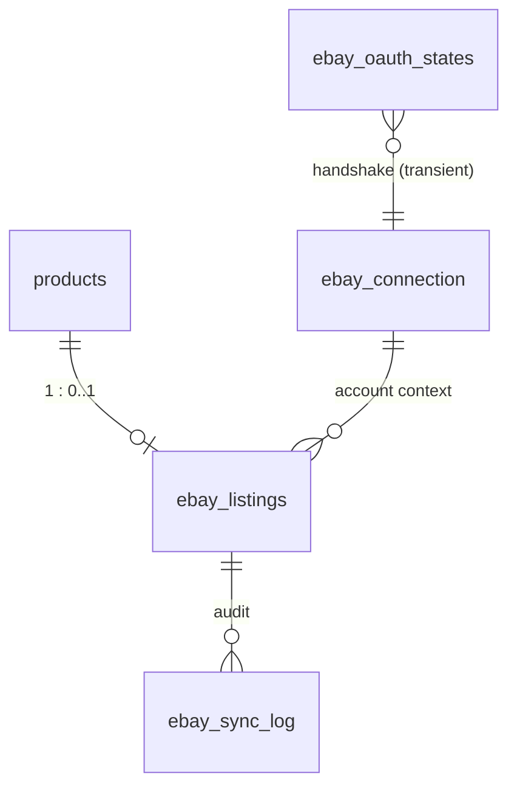

# 08 — Proposed Supabase Schema (DDL-style, NOT applied)

> Planning only. **No SQL here has been run.** When approved, this becomes an
> additive migration script in `supabase/` (e.g. `supabase/ebay-sync.sql`),
> following the conventions `supabase/etsy-sync.sql` established. All tables
> are **service-role only**: RLS enabled with no anon/authenticated policies
> — the same trust model as `webhook_events` and the `etsy_*` tables.
> Note from the Etsy migration: `products.id` is **`text`** (not `uuid`) —
> FK types below already reflect that.

## Entity overview



Four tables — one fewer than Etsy: **no `ebay_listing_images`**, because
images are a URL array inside one API payload, with no per-image calls or
checkpoints to track ([05-image-pipeline.md](05-image-pipeline.md)).

## `ebay_connection` — single-row OAuth + account defaults

```sql
create table ebay_connection (
  id                        int primary key default 1 check (id = 1), -- single row
  status                    text not null default 'disconnected',
    -- 'disconnected' | 'connected' | 'needs_reauth'
  ebay_username             text,
  marketplace_id            text not null default 'EBAY_US',
  scopes                    text[],                      -- granted scope set
  access_token_enc          text,                        -- AES-GCM, key in Netlify env
  access_token_expires_at   timestamptz,                 -- ~2h horizon
  refresh_token_enc         text,                        -- NON-rotating (eBay)
  refresh_token_expires_at  timestamptz,                 -- ~18 months; drives the reconnect countdown
  -- one-time account defaults (see 06-account-prerequisites.md)
  fulfillment_policy_id     text,       -- standard shipping (live: "NEJ Insured Flat Rate")
  payment_policy_id         text,
  return_policy_id          text,
  merchant_location_key     text,
  -- price-tiered express shipping (Q16, added 2026-07-09)
  express_fulfillment_policy_id    text,    -- live: "NEJ Express High-Value" (FedEx 2Day, $50, 1-day handling)
  high_value_shipping_threshold    numeric not null default 1000, -- admin-editable
  -- cached selling-limit snapshot (refreshed on status reads)
  selling_limit_amount      numeric,
  selling_limit_quantity    int,
  selling_limit_checked_at  timestamptz,
  -- sync policy (owner-editable in admin; defaults = the decided answers
  -- in 13-open-questions.md, 2026-07-09)
  auto_publish              boolean not null default false, -- Q1: review-first
  sold_handling             text not null default 'quantity_zero',
    -- 'quantity_zero' | 'withdraw'  (Q7: quantity-zero decided)
  best_offer_enabled        boolean not null default false, -- Q9: off
  price_push_enabled        boolean not null default false,
  price_push_threshold_pct  numeric not null default 1.0,   -- Q3: same as Etsy
  price_markup_pct          numeric not null default 15,    -- Q2: admin-variable, seeded 15%
  -- Phase 3 order-poll cursor
  orders_cursor             timestamptz,
  connected_at              timestamptz,
  updated_at                timestamptz not null default now()
);
alter table ebay_connection enable row level security;  -- no policies: service-role only
```

## `ebay_oauth_states` — transient OAuth handshake state

```sql
create table ebay_oauth_states (
  state          text primary key,          -- CSRF nonce
  admin_user_id  text not null,             -- who initiated
  created_at     timestamptz not null default now()
    -- rows older than 10 min are invalid; callback deletes on use,
    -- connect route opportunistically purges expired rows
    -- (no code_verifier column — eBay OAuth has no PKCE, see 04)
);
alter table ebay_oauth_states enable row level security;
```

## `ebay_listings` — product ↔ SKU/offer/listing mapping + sync state machine

```sql
create table ebay_listings (
  product_id        text primary key references products(id) on delete cascade,
  ebay_sku          text not null unique,    -- pushed SKU (= products.id, decided Q11)
  ebay_offer_id     text unique,             -- null until offer created
  ebay_listing_id   text unique,             -- null until published; CHANGES on re-publish after withdraw
  sync_state        text not null default 'pending',
    -- 'pending' | 'item_synced' | 'offer_created' | 'review'
    -- | 'published' | 'out_of_date' | 'hidden_oos' | 'ended' | 'error'
    -- (state machine: 03-sync-lifecycle.md)
  content_hash      text,                    -- hash of last successfully pushed mapped payload
  last_pushed_price numeric,                 -- for threshold-based price push
  last_pushed_qty   int,
  category_id       text,                    -- pinned or admin-overridden eBay leaf
  last_error        text,                    -- operator-friendly summary (redacted)
  error_count       int not null default 0,  -- consecutive failures, for backoff/giving up
  created_at        timestamptz not null default now(),
  updated_at        timestamptz not null default now()
);
create index ebay_listings_sync_state_idx on ebay_listings (sync_state);
alter table ebay_listings enable row level security;
```

`on delete cascade`: deleting a product drops the mapping — the withdraw step
must run **before** product deletion (same guarded-delete rule as Etsy),
otherwise the listing is orphaned live on eBay (log loudly). Note the
orphan is worse here than on Etsy (the listing is public and purchasable, not
a private draft) — the guarded product-delete flow must treat a live
`ebay_listing_id` as a hard "withdraw first" gate.

## `ebay_sync_log` — audit + dead-letter

```sql
create table ebay_sync_log (
  id            bigint generated always as identity primary key,
  product_id    text,                        -- nullable: connection-level events too
  listing_id    text,
  action        text not null,               -- 'put_item'|'create_offer'|'publish'|'update'
                                             -- |'price_push'|'hide_oos'|'withdraw'|'restore'
                                             -- |'order_ingest'|'connect'|'account_deletion'…
  outcome       text not null,               -- 'ok' | 'warning' | 'error'
  message       text,                        -- operator-friendly, secrets redacted
  detail        jsonb,                       -- allowlisted request/response summary, ebay errorId(s)
  created_at    timestamptz not null default now()
);
create index ebay_sync_log_product_idx on ebay_sync_log (product_id, created_at desc);
alter table ebay_sync_log enable row level security;
```

Retention: prune rows older than ~90 days via the sync engine's housekeeping
(opportunistic, no cron dependency — same as the Etsy log).

## `claim_next_pending_ebay_listing()` — bulk-drain claim RPC

Mirror of `claim_next_pending_etsy_listing()`: `FOR UPDATE SKIP LOCKED`,
claims `sync_state='pending'` only, so two concurrent drains can never grab
the same product. The Etsy build's follow-on fixes are **requirements here
from day one**: a re-enqueued item that already has an `ebay_offer_id` /
`ebay_listing_id` must be detected by the runner (`effectiveMode='update'`)
so it reaches a terminal state instead of being re-claimed forever, plus the
drain seen-guard and stall guard (see `project-docs/CHANGELOG.md` 2026-07-08
session 9, seventeenth addendum — the bulk-sync runaway fix).

## Phase 3 — reuse, don't add

- Order ingest is **polling-based** ([03-sync-lifecycle.md](03-sync-lifecycle.md)
  Flow 4): the cursor lives in `ebay_connection.orders_cursor`; per-order
  idempotency is `ebay_sync_log` `action='order_ingest'` keyed by `orderId`
  in `detail` — with a unique partial index if volume ever warrants it. No
  new table.
- The **account-deletion notification endpoint**
  ([15-compliance.md](15-compliance.md)) reuses the existing
  **`webhook_events`** table (`provider='ebay'`, unique
  `(provider, event_id)` = notificationId) exactly like the PayPal webhook —
  no new table.

## What is deliberately NOT stored

- No image bytes/base64 anywhere (project hard rule) — trivially true here,
  the server never touches image bytes at all.
- No eBay catalog copies (titles/descriptions from eBay) — only IDs, states,
  and our own hashes; the mirror is one-way
  ([15-compliance.md](15-compliance.md) — the API License Agreement's
  delete-when-no-longer-needed caching rule is easiest to satisfy by never
  caching content).
- No buyer PII from eBay orders (Phase 3 reads orders transiently to match
  SKUs; only order/line-item IDs land in the log). This is also what keeps
  the account-deletion notification handler nearly a no-op
  ([15-compliance.md](15-compliance.md)).
