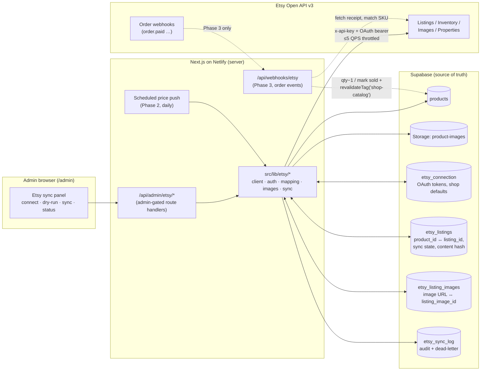

# 01 — Architecture Overview

> Planning only. See [README.md](README.md) for index.

## Principles

1. **Supabase `products` is the source of truth.** Etsy is a downstream
   mirror. Nothing on Etsy is ever authoritative for catalog data. The only
   data that may ever flow Etsy → us is order events (optional Phase 3), and
   even then it only decrements inventory / flips status via the same paths
   the site uses — it never edits copy, pricing inputs, or images.
2. **Admin-driven and observable.** Every push is triggered (or scheduled) by
   the owner from `/admin`, has a dry-run preview, and leaves an audit row.
3. **Small idempotent steps, not one big job.** Netlify functions have short
   timeouts and Etsy allows 5 QPS, so a "sync" is a sequence of resumable
   steps checkpointed in the DB, not a single long-running process.
4. **Flattened values at the boundary.** Etsy has no spot-formula pricing and
   no bilingual listing rows; we compute the concrete USD price (via
   `next-app/src/lib/pricing.ts`) and pick the EN copy at push time.

## System diagram

## Components

| Component | Location (proposed) | Role |
| --- | --- | --- |
| Etsy API client | `next-app/src/lib/etsy/client.ts` | Fetch wrapper: `x-api-key` header, bearer token, 5 QPS token-bucket throttle, 429/5xx backoff, typed errors. Modeled on `src/lib/paypal.ts`. |
| OAuth module | `next-app/src/lib/etsy/auth.ts` | PKCE authorize URL, code exchange, token refresh + rotation, persistence via `etsy_connection`. See [04](04-oauth-and-secrets.md). |
| Field mapper | `next-app/src/lib/etsy/mapping.ts` | Pure functions `Product` → Etsy draft/inventory/property payloads. Single place for the table in [02](02-field-mapping.md); unit-testable, also powers dry-run. |
| Image pipeline | `next-app/src/lib/etsy/images.ts` | Fetch bytes from Supabase Storage / `public/assets`, transcode WebP→JPEG, upload, record `listing_image_id`. See [05](05-image-pipeline.md). |
| Sync engine | `next-app/src/lib/etsy/sync.ts` | Step machine per product (draft → images → inventory → activate → update → delist), checkpointed in `etsy_listings`. See [03](03-sync-lifecycle.md). |
| Admin routes | `next-app/src/app/api/admin/etsy/*` | Connect/callback/status/preview/sync/disconnect. Admin-gated like `/api/admin/ai-settings`. See [09](09-api-routes.md). |
| Webhook route | `next-app/src/app/api/webhooks/etsy/route.ts` | Phase 3 order events; verified, idempotent via existing `webhook_events` pattern. |
| Admin UI | `/admin/settings` panel + Product Admin column | Connect Etsy, per-product sync button/status, bulk sync, dry-run. See [07](07-admin-ux.md). |
| Sync state tables | Supabase (`etsy_*`) | Mapping, tokens, image mapping, log. See [08](08-database-schema.md). |

## Sync directions

| Flow | Direction | Phase | Trigger |
| --- | --- | --- | --- |
| Initial publish (draft → images → inventory → activate) | Site → Etsy | 1 | Admin button (per product) |
| Bulk publish | Site → Etsy | 2 | Admin button (queued, chunked) |
| Incremental update (copy/price/qty/images changed) | Site → Etsy | 2 | Admin button + content-hash diff; scheduled price push for spot items |
| Delist on sold/archived/deleted | Site → Etsy | 2 (manual in 1) | Product status change hook / admin button |
| Etsy sale → decrement our inventory | Etsy → Site | 3 (optional) | `order.paid` webhook → receipt fetch |

## ID mapping (who owns which key)

| Ours | Theirs | Stored in |
| --- | --- | --- |
| `products.id` (uuid) | `listing_id` | `etsy_listings.product_id ↔ etsy_listings.etsy_listing_id` |
| `products.sku` | Etsy inventory `sku` (per offering) | pushed into Etsy inventory; used to match receipt line items in Phase 3 |
| image URL/path (entry in `products.image_urls`) | `listing_image_id` | `etsy_listing_images` (with source hash for change detection) |
| — | `shop_id`, `shipping_profile_id`, `return_policy_id`, `readiness_state_id`, `shop_section_id`s | `etsy_connection` / defaults columns (fetched or created once, see [06](06-shop-prerequisites.md)) |
| `product_type` (+ `jewelry_type` fallback) | `taxonomy_id` (leaf) | static map in `mapping.ts` (small, versioned in code) |

`etsy_listings` is the join table everything hangs off: sync state, last
pushed content hash, last error, timestamps. A product with no row there has
never been synced; a row with `listing_state='ended'` records a delist.

## Trust boundaries

- Etsy credentials/tokens: server-only. Read via service-role Supabase client
  inside route handlers; RLS denies all client access ([08](08-database-schema.md)).
- All `/api/admin/etsy/*` routes verify the signed-in Supabase user is an
  admin (same check as `src/lib/admin-auth.ts` consumers) **before** touching
  tokens or the Etsy API.
- Webhook route (Phase 3) verifies Etsy's signature and is idempotent via the
  existing `webhook_events` table pattern (`provider='etsy'`).
- Browser never sees the Etsy keystring, shared secret, or tokens; the admin
  UI only sees derived status (connected shop name, expiry, sync states).

## Why not a standalone worker / third-party connector?

- The catalog is small (~48 products) and the owner already lives in `/admin`;
  a Netlify-hosted admin-triggered sync avoids new infrastructure.
- Third-party sync tools can't reproduce spot-linked pricing or our
  status/quantity semantics, and would need their own credentials to both
  systems.
- The 5K QPD personal quota is far more than this catalog needs
  ([10](10-rate-limits-and-quotas.md)), so there is no scale pressure.
