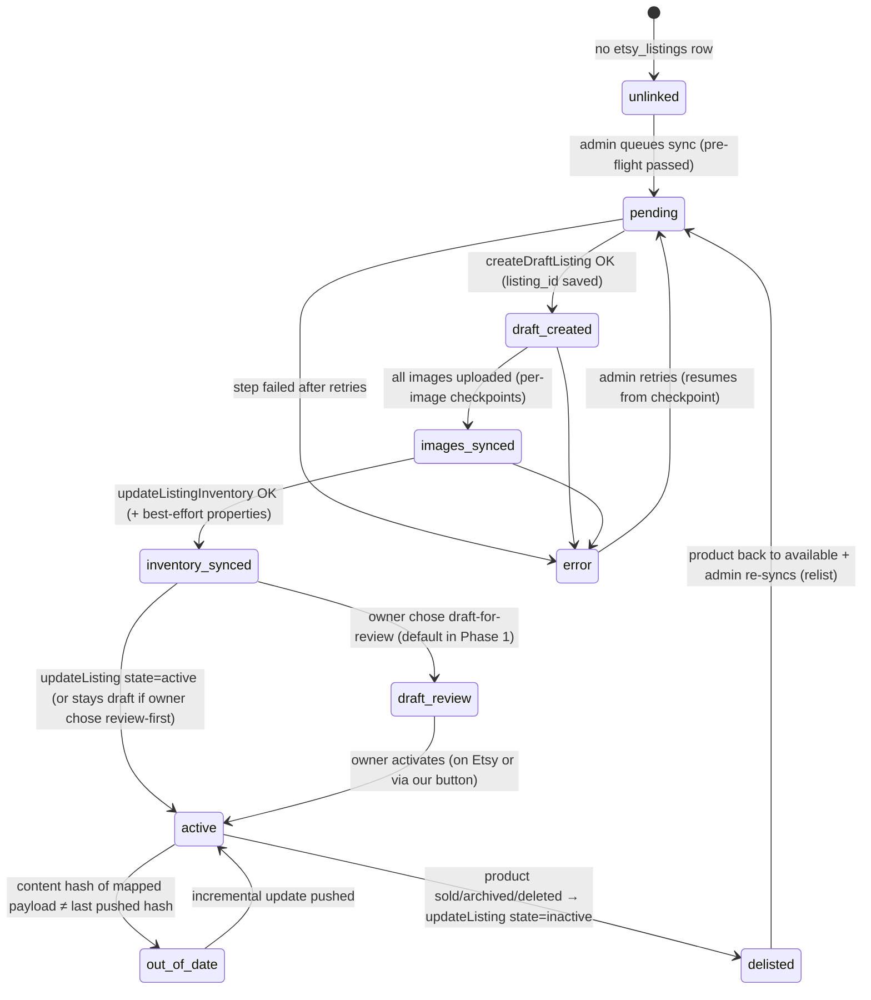

# 03 — Sync Lifecycle & State Machine

> Planning only. The sync engine (proposed `next-app/src/lib/etsy/sync.ts`)
> drives everything below; per-product state lives in `etsy_listings`
> ([08-database-schema.md](08-database-schema.md)).

## Design constraints that shape the lifecycle

- **Netlify function timeouts** (~10–26s standard): a product with 8 images is
  ~12 sequential API calls; at 5 QPS plus transcoding, that can exceed one
  invocation. So sync is a **checkpointed step machine**: each route
  invocation performs bounded work, persists progress, and tells the caller
  whether to call again. The admin browser (or the scheduler) is the loop.
- **Idempotency**: every step is safe to repeat. Steps check the DB checkpoint
  first (e.g. "draft already created → skip to images"), so a timeout or
  crash mid-product never duplicates listings or images.
- **5 QPS / 5K QPD**: the client throttles; the step design keeps individual
  invocations small. Quota math: [10-rate-limits-and-quotas.md](10-rate-limits-and-quotas.md).

## Sync state machine (per product, stored in `etsy_listings.sync_state`)

Columns backing this: `sync_state`, `etsy_listing_id`, `listing_state`
(Etsy-side state we last set/saw), `content_hash`, `last_synced_at`,
`last_error`, `error_count`. Image-level checkpoints live in
`etsy_listing_images`.

## Flow 1 — Initial publish (Phase 1: one product; Phase 2: bulk)

1. **Pre-flight (no Etsy calls):** connected? shop defaults present
   ([06](06-shop-prerequisites.md))? product `available` with `quantity ≥ 1`?
   `when_made` resolved (post-2006/missing years use the owner-attested
   `1990s` fallback and are flagged, never blocked — [02](02-field-mapping.md) §C)?
   price computable and ≥ $0.20? ≥1 image? `sku`/`inventory_number` present?
   taxonomy mapped? Failures are shown in the dry-run — nothing is pushed.
2. **Create draft** — `createDraftListing` with the mapped core payload
   (always starts inactive on Etsy). Save `etsy_listing_id`, state
   `draft_created`. *1 API call.*
3. **Upload images** — for each `image_urls` entry without a matching
   `etsy_listing_images` row: fetch bytes, transcode, `uploadListingImage`
   with `rank`. One image per loop iteration; checkpoint each. *K calls.*
4. **Inventory + properties** — `updateListingInventory` (price/qty/SKU),
   then best-effort `updateListingProperty` calls. *1–4 calls.*
5. **Activate** — `updateListing {state: active}` **or** stop at
   `draft_review` (recommended Phase 1 default; owner eyeballs the listing on
   Etsy first — [13](13-open-questions.md) Q1). *0–1 call.*
6. Record success in `etsy_sync_log`; store `content_hash` of the full mapped
   payload (see below).

**Bulk (Phase 2):** admin selects products (or "all eligible") → rows are
queued (`sync_state='pending'`). A processor endpoint pops the queue and runs
steps with a time budget (~8s), returning `{ done: false, remaining: n }`;
the admin page keeps calling until done, with live per-product progress.
~48 products ≈ ~550 calls ≈ comfortably within one afternoon of clicking
"Sync all" once ([10](10-rate-limits-and-quotas.md)).

## Flow 2 — Incremental update

**Change detection:** `content_hash` = stable hash of the *mapped output*
(title, description, tags, materials, price rounded, quantity, image URL list,
taxonomy, properties). Cheap to recompute; no Etsy reads needed.
Per-image change detection is by URL identity (crop/replace in Product Admin
produces a new Storage URL — see [05-image-pipeline.md](05-image-pipeline.md)).

Triggers:

- **Manual:** "Sync updates" button (per product or all `out_of_date`).
- **Scheduled price push (Phase 2):** spot-priced items drift with the metal
  market even when the row never changes. A daily scheduled invocation
  recomputes prices and pushes `updateListingInventory` only when the new
  price differs from the last pushed price by more than a threshold
  (recommend **≥1%**, [13](13-open-questions.md) Q4). ~48 lightweight calls/day
  worst case.

Update sub-flows, applied diff-wise:

- Copy/taxonomy/attribute change → `updateListing` (+ property calls).
- Price/qty change → `updateListingInventory` only.
- Image set change → upload new URLs, `deleteListingImage` for removed ones,
  re-rank if order changed.

## Flow 3 — Delist on sold / removed

Site-side events → Etsy `updateListing {state: inactive}`:

| Site event | Etsy action |
| --- | --- |
| Product `sold` (PayPal capture, admin mark-paid, quantity hits 0) | Deactivate listing (`inactive`) — reversible, unlike delete |
| Product `archived` / `draft` | Deactivate |
| Product deleted | `deleteListing` (or deactivate if we prefer a paper trail — recommend deactivate + log) |
| Product back to `available` (cancel/reopen/restock) | Re-activate (`state: active`) if a linked listing exists, else full re-sync |

**Phase 1:** manual — the product row's Etsy status chip shows "needs delist"
and the owner clicks it. **Phase 2:** automatic — the same server-side code
paths that call `revalidateTag('shop-catalog')` after status changes (PayPal
capture in `capture-order`, `adminUpdateProductStatus`, and the client-write
companion `adminRevalidateProduct(s)` in
`next-app/src/app/actions/admin-products.ts`) additionally enqueue an Etsy
delist/relist job. Piggybacking on the existing revalidation chokepoints means
no new "where do status changes happen" audit is needed — but any *new*
products-write path must remember both (extend the existing project rule in
`shop-cache-revalidation` memory / `project-docs`).

Latency note: between the site sale and the Etsy deactivation the item is
oversellable on Etsy. Window is seconds (automatic) — acceptable for a
low-traffic secondary channel; Phase 3's receipt matching + manual refund
covers the rare double-sale, same "whoever pays first" philosophy as the
site's no-reservation checkout.

## Flow 4 (optional, Phase 3) — Etsy sale → our inventory

Etsy webhooks are **order-only** (`order.paid`, `order.canceled`,
`order.shipped`, `order.delivered`) and the payload is just
`{ event_type, resource_url, shop_id }` — a pointer, not data.

1. `POST /api/webhooks/etsy` receives `order.paid`; verify signature; insert
   into `webhook_events` (`provider='etsy'`, unique event id) — duplicate ⇒
   200 and stop (same pattern as the PayPal webhook).
2. Fetch the receipt via `getShopReceipt` (`transactions_r`); for each
   transaction, resolve product by `listing_id` (via `etsy_listings`) with
   `sku` as cross-check.
3. Decrement `products.quantity` / flip to `sold` **via the same semantics as
   a site sale**, revalidate `shop-catalog`, deactivate any other Etsy
   listing of that product (already the same listing), write `etsy_sync_log`.
4. Conflict (already sold on site) → log + admin notification: owner refunds
   one buyer manually, mirroring the site's `item_conflict` handling.
5. `order.canceled` → optional restock (owner decision; default: notify only).

We do **not** create rows in our `orders` table for Etsy sales in Phase 3 MVP
— Etsy owns fulfillment/receipts. (Could be a Phase 4 if unified order
history is ever wanted.)

## What we never do

- Never treat Etsy as a source for catalog edits (no import of titles,
  prices, images back into `products`).
- Never bulk-delete Etsy listings automatically; delete is admin-confirmed,
  per the project's destructive-operation safety rules.
- Never sync `draft`/`pending_payment` site products outward.
