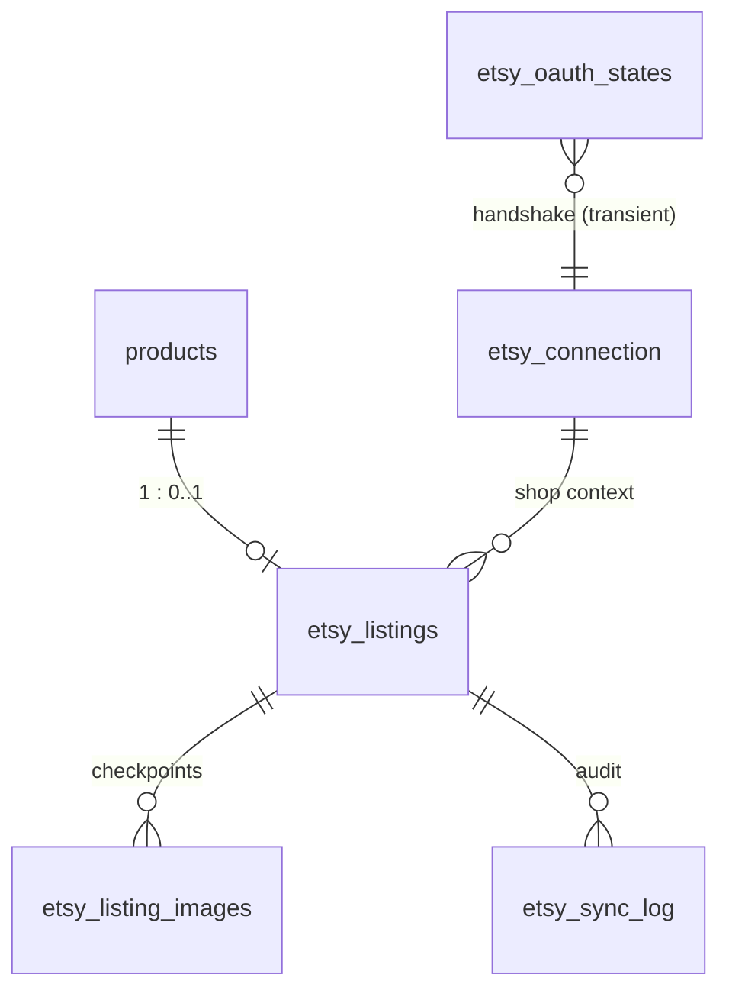

# 08 — Proposed Supabase Schema (DDL-style, NOT applied)

> Planning only. **No SQL here has been run.** When approved, this becomes an
> additive migration script in `supabase/` (e.g. `supabase/etsy-sync.sql`),
> following the project's existing migration conventions. All tables are
> **service-role only**: RLS enabled with no anon/authenticated policies —
> the same trust model as `webhook_events`.

## Entity overview



## `etsy_connection` — single-row OAuth + shop defaults

```sql
create table etsy_connection (
  id                       int primary key default 1 check (id = 1), -- single row
  status                   text not null default 'disconnected',
    -- 'disconnected' | 'connected' | 'needs_reauth'
  etsy_user_id             bigint,
  shop_id                  bigint,
  shop_name                text,
  scopes                   text[],                      -- granted scope set
  access_token_enc         text,                        -- AES-GCM, key in Netlify env
  access_token_expires_at  timestamptz,
  refresh_token_enc        text,                        -- rotates on every refresh
  refresh_token_updated_at timestamptz,
  -- one-time shop defaults (see 06-shop-prerequisites.md)
  shipping_profile_id      bigint,
  return_policy_id         bigint,
  readiness_state_id       bigint,
  section_map              jsonb not null default '{}', -- product_type -> shop_section_id
  -- sync policy (owner-editable in admin, defaults per 13-open-questions.md)
  auto_activate            boolean not null default false, -- draft-for-review default
  auto_delist_on_sold      boolean not null default false, -- Phase 2 flips default on
  price_push_enabled       boolean not null default false,
  price_push_threshold_pct numeric not null default 1.0,
  price_markup_pct         numeric not null default 8,     -- Etsy-fee markup, decided 8% (Q5)
  connected_at             timestamptz,
  updated_at               timestamptz not null default now()
);
alter table etsy_connection enable row level security;  -- no policies: service-role only
```

## `etsy_oauth_states` — transient PKCE handshake state

```sql
create table etsy_oauth_states (
  state          text primary key,          -- CSRF nonce
  code_verifier  text not null,             -- PKCE verifier (single-use)
  admin_user_id  uuid not null,             -- who initiated
  created_at     timestamptz not null default now()
    -- rows older than 10 min are invalid; callback deletes on use,
    -- connect route opportunistically purges expired rows
);
alter table etsy_oauth_states enable row level security;
```

## `etsy_listings` — product ↔ listing mapping + sync state machine

```sql
create table etsy_listings (
  product_id        uuid primary key references products(id) on delete cascade,
  etsy_listing_id   bigint unique,           -- null until draft created
  sync_state        text not null default 'pending',
    -- 'pending' | 'draft_created' | 'images_synced' | 'inventory_synced'
    -- | 'draft_review' | 'active' | 'out_of_date' | 'delisted' | 'error'
    -- (state machine: 03-sync-lifecycle.md)
  listing_state     text,                    -- last known Etsy-side state we set/saw
                                             -- ('draft'|'active'|'inactive'|'ended')
  content_hash      text,                    -- hash of last successfully pushed mapped payload
  last_pushed_price numeric,                 -- for threshold-based price push
  taxonomy_id       bigint,
  last_synced_at    timestamptz,
  last_error        text,                    -- operator-friendly summary (redacted)
  error_count       int not null default 0,  -- consecutive failures, for backoff/giving up
  created_at        timestamptz not null default now(),
  updated_at        timestamptz not null default now()
);
create index etsy_listings_sync_state_idx on etsy_listings (sync_state);
alter table etsy_listings enable row level security;
```

`on delete cascade`: deleting a product drops the mapping — the delist step
must run **before** product deletion (enforced in the sync engine / guarded
delete flow), otherwise the listing is orphaned on Etsy (log loudly).

## `etsy_listing_images` — per-image checkpoint + change detection

```sql
create table etsy_listing_images (
  id                     bigint generated always as identity primary key,
  product_id             uuid not null references products(id) on delete cascade,
  etsy_listing_id        bigint not null,
  source_url             text not null,      -- exact entry from products.image_urls
  source_key             text not null,      -- storage path or /assets path (domain-stable)
  bytes_sha256           text,               -- computed during upload (05-image-pipeline.md)
  etsy_listing_image_id  bigint not null,
  rank                   int not null,
  uploaded_at            timestamptz not null default now(),
  unique (etsy_listing_id, source_key)
);
alter table etsy_listing_images enable row level security;
```

## `etsy_sync_log` — audit + dead-letter

```sql
create table etsy_sync_log (
  id            bigint generated always as identity primary key,
  product_id    uuid,                        -- nullable: connection-level events too
  listing_id    bigint,
  action        text not null,               -- 'create_draft'|'upload_image'|'set_inventory'
                                             -- |'set_property'|'activate'|'update'|'delist'
                                             -- |'relist'|'price_push'|'order_ingest'|'connect'…
  outcome       text not null,               -- 'ok' | 'warning' | 'error'
  message       text,                        -- operator-friendly, secrets redacted
  detail        jsonb,                       -- request/response summary (redacted), etsy error code
  created_at    timestamptz not null default now()
);
create index etsy_sync_log_product_idx on etsy_sync_log (product_id, created_at desc);
alter table etsy_sync_log enable row level security;
```

Retention: prune rows older than ~90 days via the sync engine's housekeeping
(no cron dependency; opportunistic like `etsy_oauth_states` purge).

## Phase 3 addition — reuse, don't add

Etsy order webhooks reuse the existing **`webhook_events`** table
(`provider='etsy'`, unique `(provider, event_id)`) exactly like PayPal — no
new table. Receipt-ingest outcomes are recorded in `etsy_sync_log`
(`action='order_ingest'`).

## What is deliberately NOT stored

- No image bytes/base64 anywhere (project hard rule).
- No Etsy catalog copies (titles/descriptions from Etsy) — we only store IDs,
  states, and hashes; the mirror is one-way ([15-compliance.md](15-compliance.md)
  on caching minimalism).
- No buyer PII from Etsy receipts (Phase 3 reads receipts transiently to match
  SKUs; only order/transaction IDs land in the log).
